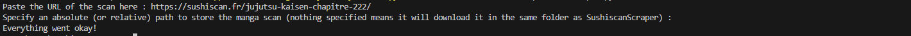

# SushiscanScraper
## A python script to bulk download scans from Sushiscan.


# /!\ WARNING

- It currently only works with the two websites `sushiscan.fr` and `anime-sama.me` (I actually had something working for `sushiscan.net`, using the `forceFullMode` function but it broke down on 14/10/2023 due to not being able to bypass Cloudflare's challenges. I'm looking into this, but there is no guarantee I manage to bring it back up.)

### Requirements 
- Python 3.10.0 and above should work just fine.
- See `requirements.txt`.
### Installation

- Clone it via git, or download the zip and extract in the desired folder. 
- Head to the correct directory and type
```ps
pip install requirements.txt
```
### Usage

- You can then run the program using python, which should propose something like this : 


- If you see any other message than "Everything went okay!", please double check the URL you provided before opening an issue here. The error handler system is not fully working right now. Please refer to the `ISSUE_TEMPLATE` page in `./github/workflows`.

Enjoy.

### Objectives :

- Bypass cloudflare to allow people to have access to a bigger library. (i.e using sushiscan.net URLs instead of sushiscan.fr)
- Allow to bulk download (like download every single page of a manga at once, or downloading only certain chapters, or downloading a range of chapters)