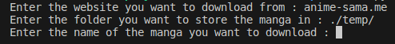
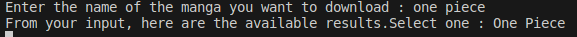
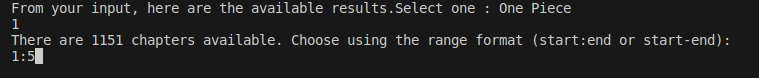

# SushiscanScraper
## A python script to bulk download scans from Sushiscan.


# /!\ WARNING

- It currently only works with the two websites `sushiscan.fr` and `anime-sama.me` (I actually had something working for `sushiscan.net`, using the `forceFullMode` function but it broke down on 14/10/2023 due to not being able to bypass Cloudflare's challenges. I'm looking into this, but there is no guarantee I manage to bring it back up.)

### Requirements 
- Python 3.10.0 and above should work just fine.
- See `requirements.txt`.
### Installation

- Clone it via git, or download the zip and extract in the desired folder. 
- Head to the correct directory and type
```ps
pip install requirements.txt
```
### Usage

- You can then run the program using python, which should propose something like this : 


- You then have two options :
 - - Using the direct URL of the manga's chapter.
 - - Typing a manga's name such as One Piece, One Punch Man etc. It will then display something like this :
 <br/>


- Well, since there is only one result, you can only choose `1` as an answer. But you could have several : in this case, input a number between 1 and the number of results!

- Use a "range" format to explain which chapters to choose. You can also type all to get them all !


Enjoy. If there are any error you understand, please go ahead and open an issue with your debug log files.

### Objectives :

- ~~Bypass cloudflare to allow people to have access to a bigger library. (i.e using sushiscan.net URLs instead of sushiscan.fr)~~ (didn't manage a way around that. Tried cloudscraper, proxies, captcha solvers but nothing that was free worked. If you have any advices on that, I'll gladly add it to the program.)
- ~~Allow to bulk download (like download every single page of a manga at once, or downloading only certain chapters, or downloading a range of chapters)~~